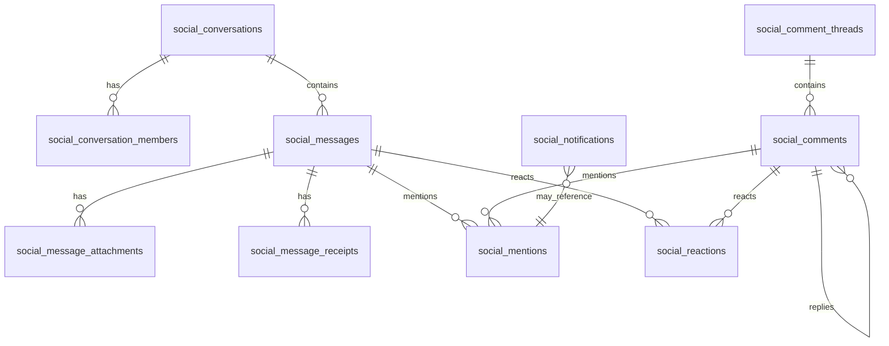

# Enterprise Chat, Comment, Reaction, Mention, and Notification System

## Scope

This design extends the existing Spring Boot + Next.js ecommerce system with a Messenger/Facebook-style collaboration layer. The current support chat can keep running while the new `social_*` schema and frontend components are wired into dedicated services.

## Backend Architecture

- `modules/social/conversation`: one-to-one, group, support, and order conversations.
- `modules/social/message`: send/edit/delete/reply/forward/search messages, attachments, link previews, read receipts, typing status.
- `modules/social/comment`: product/order/task comment threads, infinite nested replies, sort by newest/relevant/liked.
- `modules/social/reaction`: reusable reaction engine for messages and comments.
- `modules/social/mention`: parses `@admin`, `@employee`, `@shipper`, and `@username`; validates RBAC and creates mention records.
- `modules/social/notification`: in-app and WebSocket notifications, read/unread, grouping, browser/mobile-push-ready payloads.
- `modules/social/realtime`: STOMP event publisher. For multiple backend nodes, replace `enableSimpleBroker` with a broker relay or Redis/Rabbit fanout.

## Database ERD

Migration: `backend/src/main/resources/db/migration/V43__enterprise_social_messaging_foundation.sql`.

## REST API Design

- `GET /api/social/conversations?cursor=&limit=`
- `POST /api/social/conversations`
- `GET /api/social/conversations/{id}/messages?before=&limit=`
- `POST /api/social/conversations/{id}/messages`
- `PATCH /api/social/messages/{id}` for edit/pin/delete-for-everyone.
- `POST /api/social/messages/{id}/delete-for-self`
- `POST /api/social/messages/{id}/forward`
- `POST /api/social/messages/{id}/receipts/read`
- `GET /api/social/search/messages?q=&conversationId=`
- `GET /api/social/comment-threads/{targetType}/{targetId}`
- `POST /api/social/comment-threads/{threadId}/comments`
- `PATCH /api/social/comments/{id}`
- `DELETE /api/social/comments/{id}`
- `PUT /api/social/reactions/{targetType}/{targetId}`
- `DELETE /api/social/reactions/{targetType}/{targetId}`
- `GET /api/social/notifications?unreadOnly=&cursor=`
- `POST /api/social/notifications/{id}/read`
- `GET /api/social/mentions/suggestions?q=&scope=`

All write APIs should be idempotency-key aware for optimistic UI retries.

## WebSocket Events

Client publishes:

- `/app/social.message.send`
- `/app/social.message.typing`
- `/app/social.message.read`
- `/app/social.reaction.set`
- `/app/social.comment.create`

Server broadcasts:

- `/topic/social/conversations/{conversationId}/messages`
- `/topic/social/conversations/{conversationId}/typing`
- `/topic/social/conversations/{conversationId}/receipts`
- `/topic/social/comment-threads/{threadId}`
- `/topic/social/reactions/{targetType}/{targetId}`
- `/topic/social/notifications/{userId}`
- `/topic/social/mentions/{userId}`

## Mention Workflow

1. Client autocomplete queries users and role aliases.
2. Backend parses mentions from rich-text/plain body.
3. RBAC validates whether actor may tag the target role/user.
4. Insert `social_mentions`.
5. Insert grouped `social_notifications`.
6. Publish WebSocket notification and mention badge update.
7. If `priority=urgent`, set `escalation_due_at` and enqueue escalation.

Example body: `@shipper_john please handle this order urgently.`

## Notification Workflow

- Persist every notification first.
- Publish realtime event after commit.
- Browser notification is opt-in on frontend using the same payload.
- Mobile push can be added by a worker consuming unread high-priority notifications.
- Group by `group_key`, for example `conversation:conv_123` or `order:ORD-1001`.

## Frontend Architecture

Reusable components added under `frontend/components/social`:

- `MessengerShell`: conversation sidebar, message list, reply/forward/edit/delete actions, read/delivered display.
- `CommentThread`: nested Facebook-style replies with visual rails and sort controls.
- `ReactionPicker`: hover popup with supported reactions and counts.
- `MentionComposer`: autocomplete mentions, optimistic submit, emoji, drag/drop/file upload surface.

Demo page: `frontend/app/workspace/social/page.tsx`.

## Security

- Sanitize rich text on backend with an allowlist before storage/rendering.
- Validate uploads by MIME, extension, size, checksum, and malware scan status.
- Use signed URLs for private media.
- Validate conversation membership and comment target permission on every request.
- Rate limit message sends, reactions, uploads, and mention searches.
- Keep `deleted_at`/audit events for moderation and compliance.

## Performance

- Cursor pagination uses `(conversation_id, created_at DESC, message_id DESC)`.
- Reaction counts are denormalized in `social_reaction_counts`.
- Message search uses a GIN full-text index.
- Use virtualized lists for large conversations.
- Store media in object storage and serve through CDN.
- Move STOMP fanout to Redis/Rabbit when running more than one backend node.

## Deployment Strategy

1. Deploy migration V43.
2. Ship read-only API endpoints and the UI behind a feature flag.
3. Enable message/comment writes for staff first.
4. Enable customer-facing entry points.
5. Add Redis/Rabbit broker relay before high-traffic launch.
6. Add background workers for link previews, media scanning, push notifications, and escalation.
