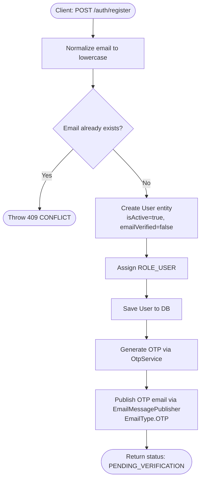
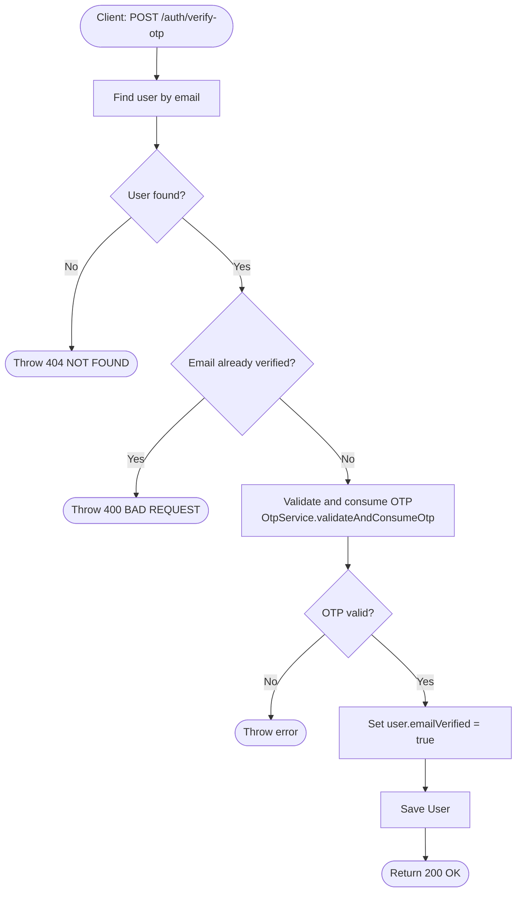
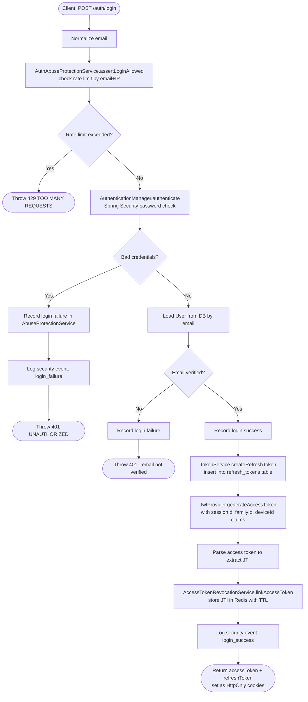
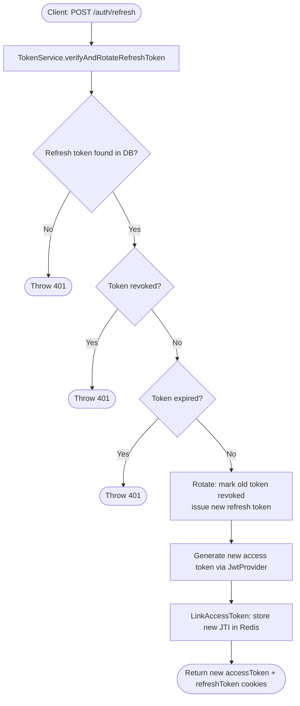
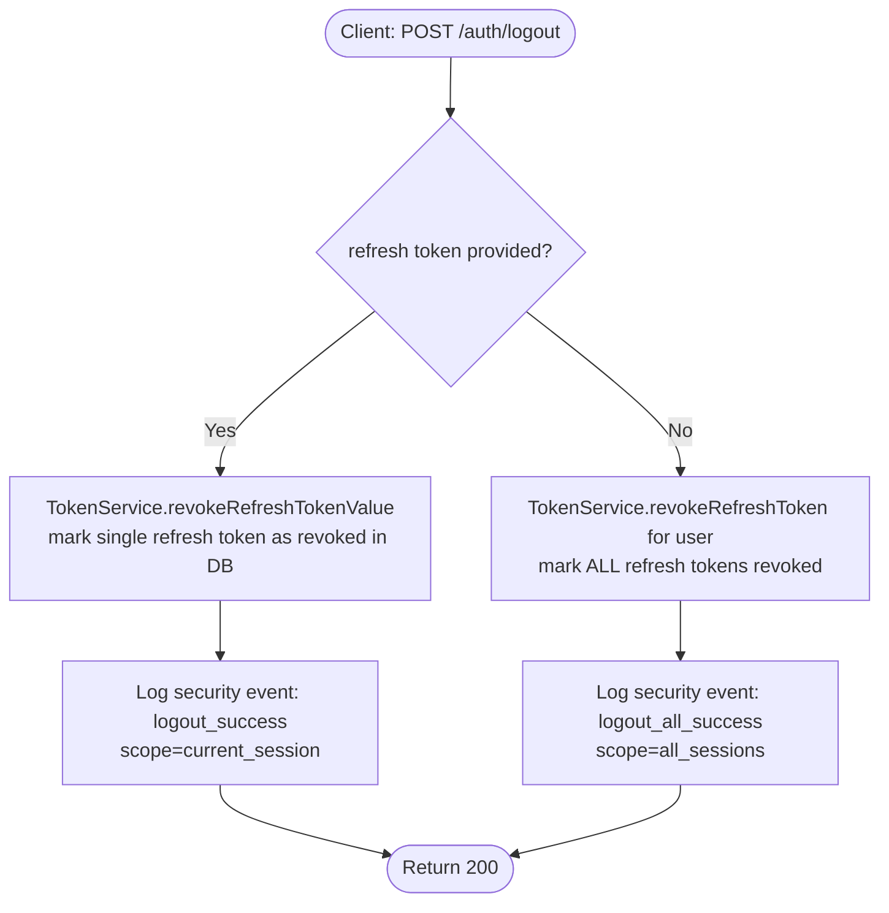
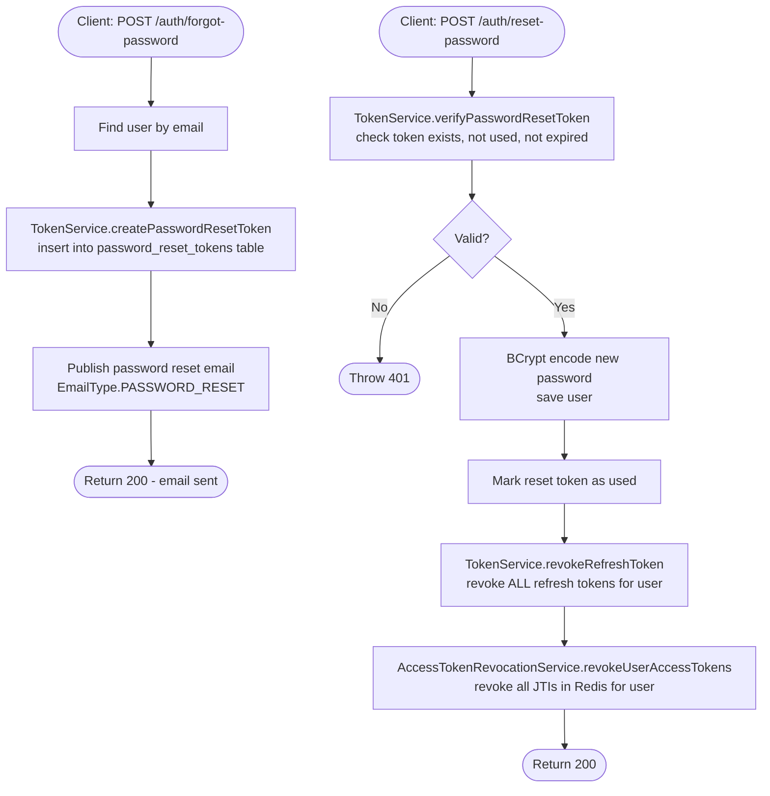
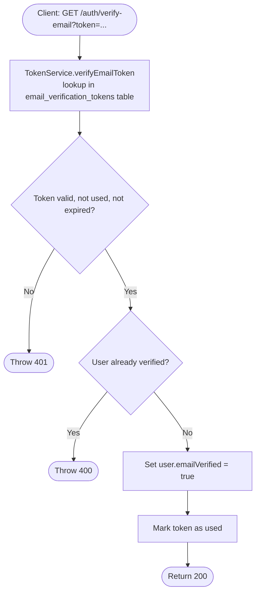
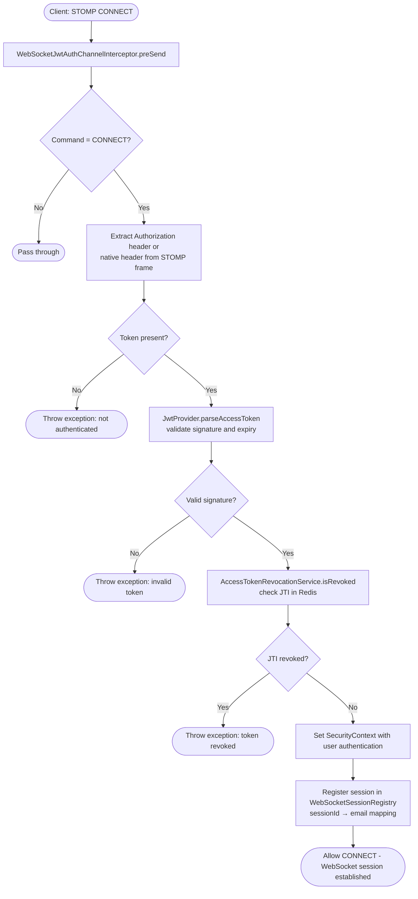

# Authentication Activity Diagram

Activity flows traced from [`AuthServiceImpl.java`](../../backend/src/main/java/com/example/shop/modules/auth/service/AuthServiceImpl.java).

## Registration Flow

## OTP Verification Flow

## Login Flow

## Token Refresh Flow

## Logout Flow

## Password Reset Flow

## Email Verification Link Flow

## WebSocket Authentication Flow (STOMP CONNECT)

