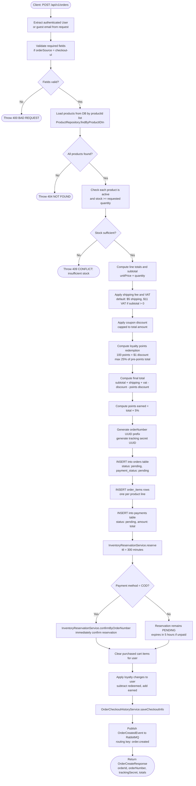
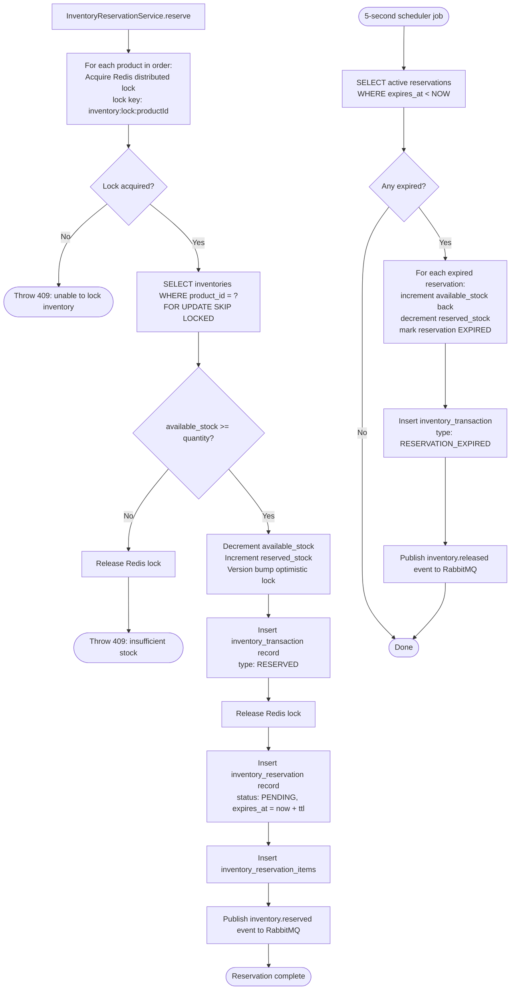
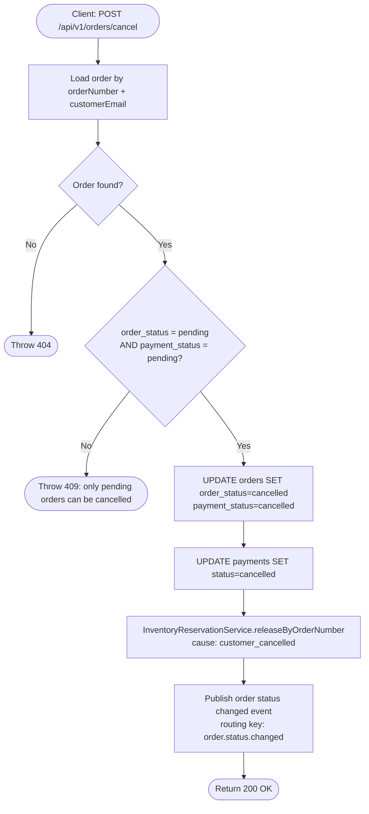

# Checkout Activity Diagram

Activity flows traced from [`OrderServiceImpl.java`](../../backend/src/main/java/com/example/shop/modules/order/service/OrderServiceImpl.java) and [`InventoryReservationServiceImpl.java`](../../backend/src/main/java/com/example/shop/modules/inventory/service/InventoryReservationServiceImpl.java).

## Order Creation (Checkout) Flow

## Inventory Reservation Flow (Detail)

## Order Cancellation Flow (Customer)

