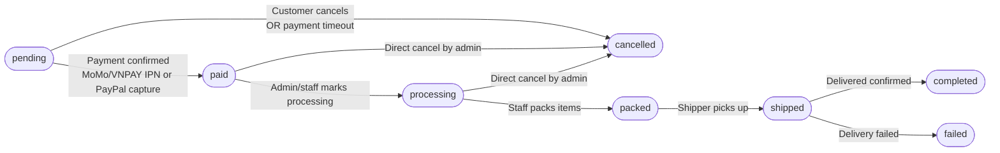
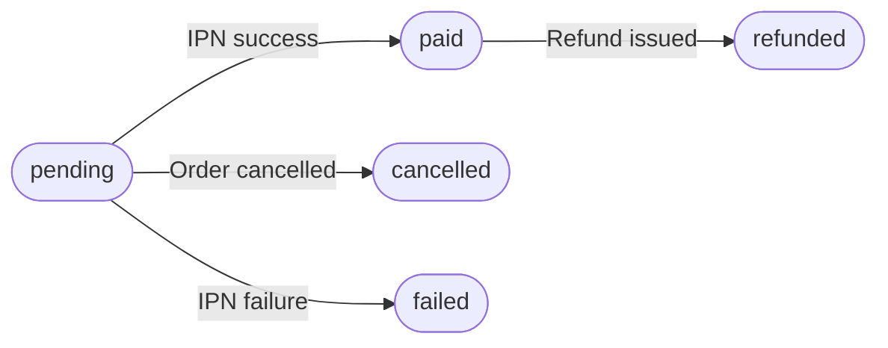
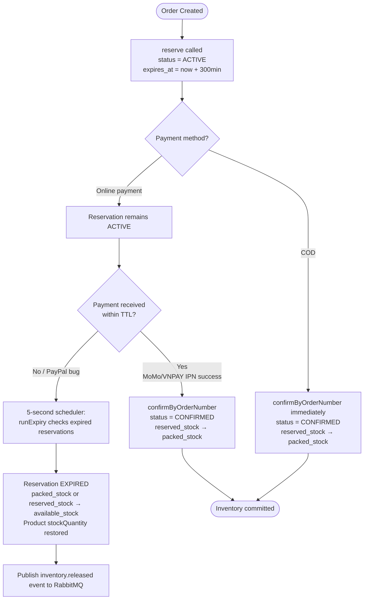
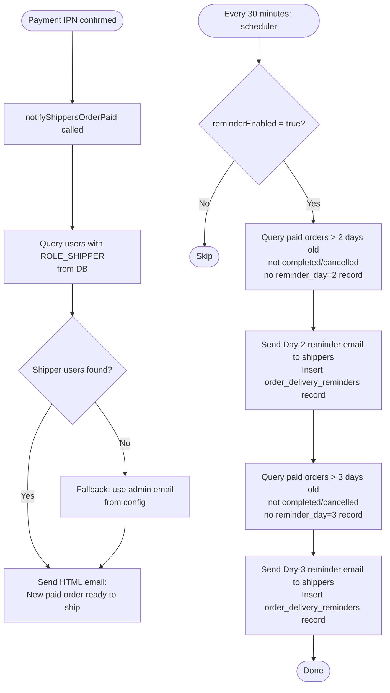
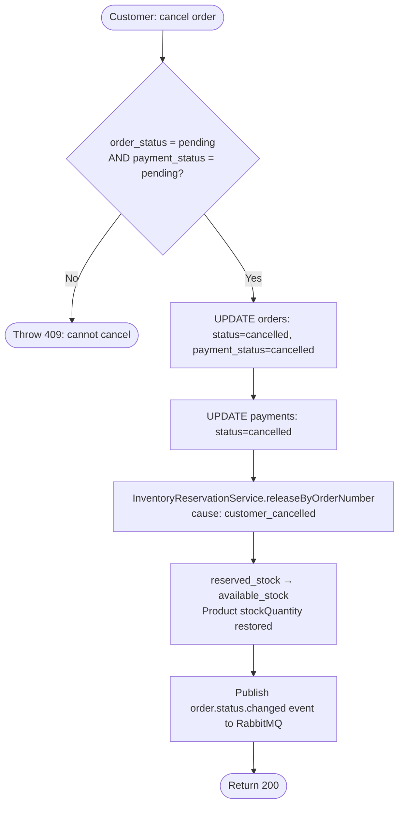

# Order Processing Activity Diagram

Flows traced from [`OrderServiceImpl.java`](../../backend/src/main/java/com/example/shop/modules/order/service/OrderServiceImpl.java), [`InventoryReservationServiceImpl.java`](../../backend/src/main/java/com/example/shop/modules/inventory/service/InventoryReservationServiceImpl.java), and [`FulfillmentNotificationService.java`](../../backend/src/main/java/com/example/shop/modules/order/service/FulfillmentNotificationService.java).

## Order Status State Machine

## Payment Status State Machine

## Inventory Reservation Lifecycle

## Fulfillment Notification Flow

## Customer Order Cancellation

