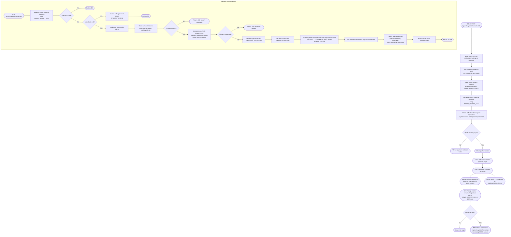
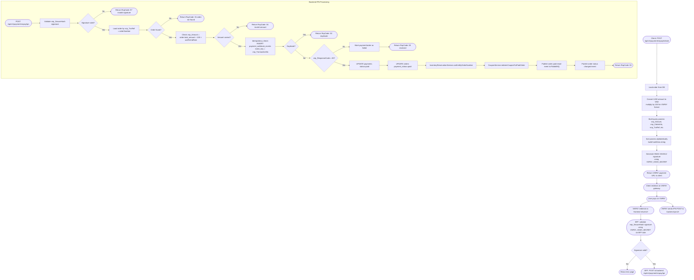
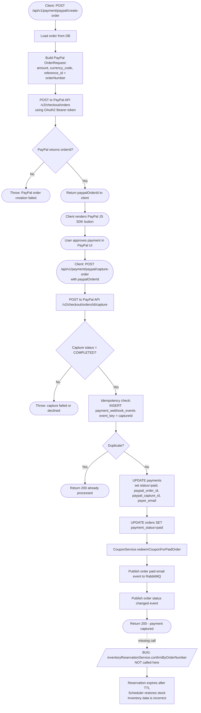

# Payment Activity Diagrams

Flows traced from [`MomoPaymentServiceImpl.java`](../../backend/src/main/java/com/example/shop/modules/payment/service/MomoPaymentServiceImpl.java), [`VnpayPaymentServiceImpl.java`](../../backend/src/main/java/com/example/shop/modules/payment/service/VnpayPaymentServiceImpl.java), and [`PayPalPaymentServiceImpl.java`](../../backend/src/main/java/com/example/shop/modules/payment/paypal/service/PayPalPaymentServiceImpl.java).

> [!CAUTION]
> **Known Bug — PayPal Inventory Leak**: `PayPalPaymentServiceImpl.triggerPostPaymentActions()` does **not** call `inventoryReservationService.confirmByOrderNumber()`. The inventory reservation remains in `PENDING` state and will be released by the 5-second scheduler when it expires, adding stock back. This causes incorrect inventory counts for paid PayPal orders.

---

## MoMo Payment Flow

---

## VNPAY Payment Flow

---

## PayPal Payment Flow

> [!WARNING]
> PayPal does **not** confirm inventory reservation on capture. See caution note at the top of this document.

