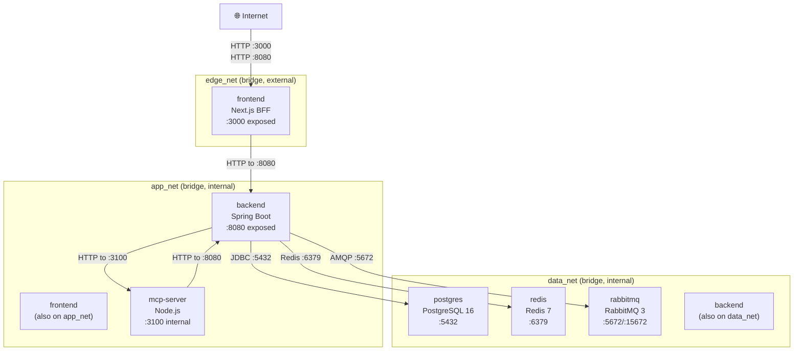
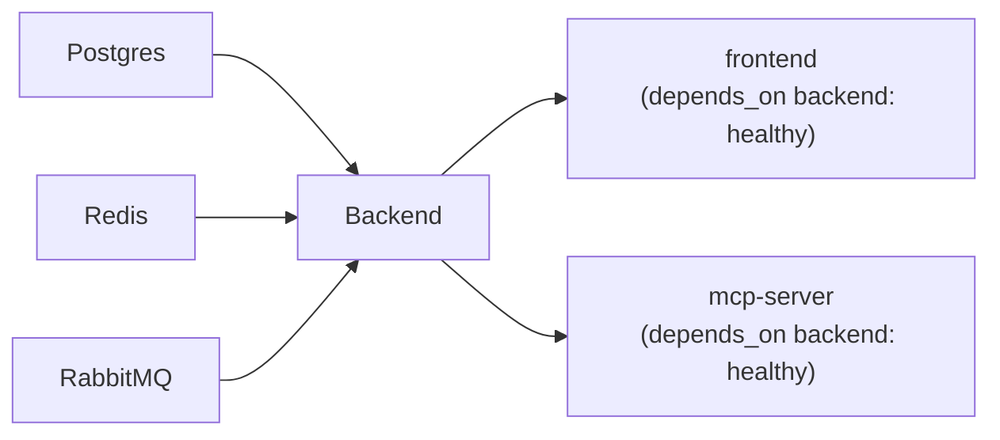

# Deployment Architecture Diagram

This document describes the actual containerization and network topology as defined in [`docker-compose.prod.yml`](../../docker-compose.prod.yml).

## Container Overview

| Container | Image | Exposed Ports | Networks | Resource Limits |
|---|---|---|---|---|
| `postgres` | `postgres:16-alpine` | none (internal) | `data_net` | — |
| `redis` | `redis:7-alpine` | none (internal) | `data_net` | — |
| `rabbitmq` | `rabbitmq:3-management-alpine` | none (internal) | `data_net` | — |
| `backend` | built from `./backend` | `8080:8080` | `app_net`, `data_net` | 1 GB RAM, 1 CPU |
| `mcp-server` | built from `./mcp-server` | `3100` (internal expose only) | `app_net` | 512 MB RAM, 0.5 CPU |
| `frontend` | built from `./frontend` | `3000:3000` | `edge_net`, `app_net` | 768 MB RAM, 0.75 CPU |

## Network Topology

> [!NOTE]
> `frontend` connects to **both** `edge_net` (to receive external traffic) and `app_net` (to communicate with `backend`). `backend` connects to **both** `app_net` (for frontend and mcp-server access) and `data_net` (for database, redis, and rabbitmq access). `mcp-server` is on `app_net` only — it is not directly reachable from the internet.

## Container Dependency Chain

All dependencies use `condition: service_healthy`, ensuring containers wait for health checks before starting.

## Volume Definitions

| Volume | Mounted in | Path |
|---|---|---|
| `postgres_data` | `postgres` | `/var/lib/postgresql/data` |
| `redis_data` | `redis` | `/data` |
| `rabbitmq_data` | `rabbitmq` | `/var/lib/rabbitmq` |

## Security Configuration (x-default-security)

All application containers (`backend`, `mcp-server`, `frontend`) apply:
- `security_opt: no-new-privileges:true, seccomp=default`
- `cap_drop: ALL` — all Linux capabilities dropped
- `read_only: true` — root filesystem read-only
- `tmpfs: /tmp:size=64m,noexec,nosuid,nodev` — writable tmpfs for /tmp
- `pids_limit: 256` — process count limited

## Secrets

| Secret | Source file | Used by |
|---|---|---|
| `postgres_password` | `./secrets/postgres_password.txt` | `postgres` container via `POSTGRES_PASSWORD_FILE` |

## Environment Variables (Sources)

- `.env.prod` (optional, loaded by backend, mcp-server, frontend)
- Inline `environment:` blocks in docker-compose.prod.yml
- Build-time ARGs for frontend: `NEXT_PUBLIC_API_URL`, `NEXT_PUBLIC_BACKEND_URL`, `BACKEND_URL`

## Health Checks

| Container | Health Check Command | Interval | Start Period |
|---|---|---|---|
| `postgres` | `pg_isready -U $DB_USER -d $DB_NAME` | 10s | — |
| `redis` | `redis-cli ping` | 10s | — |
| `rabbitmq` | `rabbitmq-diagnostics -q ping` | 20s | **60s** |
| `backend` | `wget -qO- http://127.0.0.1:8080/api/health` | 20s | 60s |
| `mcp-server` | `wget -qO- http://127.0.0.1:3100/health` | 20s | — |
| `frontend` | `wget -qO- http://127.0.0.1:3000` | 20s | 30s |

> [!NOTE]
> RabbitMQ has a 60-second `start_period` because its Mnesia database initialization can take 30–60 seconds on first boot.
