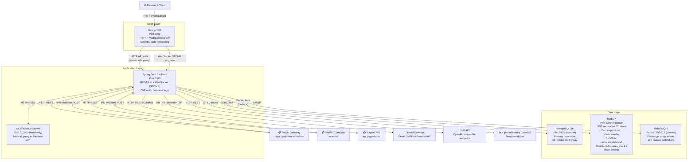
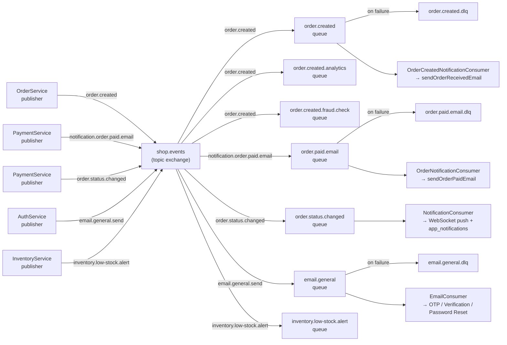

# System Architecture Diagram

This document describes the physical system architecture based on the actual source code and configuration files.

Sources: [`docker-compose.prod.yml`](../../docker-compose.prod.yml), [`application.yml`](../../backend/src/main/resources/application.yml), [`mcp-server/src/index.ts`](../../mcp-server/src/index.ts).

## System Overview

## Key Interactions

| Interaction | Protocol | Notes |
|---|---|---|
| Browser ↔ Next.js BFF | HTTP, WebSocket | BFF acts as secure reverse proxy |
| BFF → Spring Boot Backend | HTTP (server-side) | API routes in `frontend/app/api/` |
| Backend → PostgreSQL | JDBC (PostgreSQL 16) | JPA + raw JdbcTemplate for performance |
| Backend → Redis | Lettuce (reactive) | JTI store, cache, Pub/Sub, locks |
| Backend → RabbitMQ | AMQP (Spring AMQP) | Topic exchange `shop.events` |
| Backend → MCP Node server | HTTP | `/api/mcp/tools`, `/api/mcp/resources` |
| MCP → Backend | HTTP | Tool calls proxy to backend REST endpoints |
| Payment gateways → Backend | HTTP POST (IPN) | MoMo and VNPAY send IPN directly to backend |
| BFF → Backend (IPN forward) | HTTP POST | BFF validates return URL signature, then calls backend IPN |

## RabbitMQ Exchange/Queue Architecture

## Redis Key Namespaces

| Key Pattern | Purpose |
|---|---|
| `jti:<jti-value>` | Access token JTI for revocation tracking |
| `inv:lock:reserve:<orderNumber>` | Distributed lock for inventory reservation |
| `cache:products:*` | Cached product list/search responses |
| `cache:dashboard:*` | Cached admin/seller/supplier dashboards |
| `cache:invalidate:all` | Pub/Sub channel for cache invalidation |
| `rate:login:<email>:<ip>` | Login failure rate limiting |
