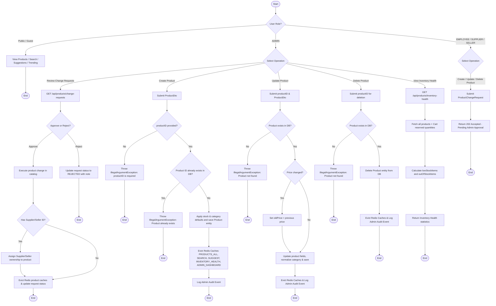

# Admin Product Management Activity Diagram

This diagram represents the product management workflow based on `ProductController`, `ProductServiceImpl`, `ProductRepository`, and `ProductMapper`.

```mermaid
flowchart TD
    Start([Start]) --> RoleCheck{User Role?}

    %% ROLE DISPATCH
    RoleCheck -->|Public / Guest| PubFlow[View Products / Search / Suggestions / Trending]
    PubFlow --> EndPub([End])

    RoleCheck -->|ADMIN| AdminOps{Select Operation}
    RoleCheck -->|EMPLOYEE / SUPPLIER / SELLER| NonAdminOps{Select Operation}

    %% NON-ADMIN (EMPLOYEE / SUPPLIER / SELLER) FLOW
    NonAdminOps -->|Create / Update / Delete Product| ChangeReq[Submit ProductChangeRequest]
    ChangeReq --> ChangeReqResp[Return 202 Accepted - Pending Admin Approval]
    ChangeReqResp --> EndChangeReq([End])

    %% ADMIN APPROVE/REJECT CHANGE REQUESTS
    AdminOps -->|Review Change Requests| ViewReqs[GET /api/products/change-requests]
    ViewReqs --> DecideReq{Approve or Reject?}
    DecideReq -->|Approve| ApprReq[Execute product change in catalog]
    ApprReq --> ApprAssign{Has Supplier/Seller ID?}
    ApprAssign -->|Yes| AssignOwner[Assign Supplier/Seller ownership to product]
    ApprAssign -->|No| ApprEvict
    AssignOwner --> ApprEvict[Evict Redis product caches & update request status]
    ApprEvict --> EndAppr([End])
    DecideReq -->|Reject| RejReq[Update request status to REJECTED with note]
    RejReq --> EndRej([End])

    %% ADMIN DIRECT CREATE
    AdminOps -->|Create Product| C1[Submit ProductDto]
    C1 --> CCheckID{productID provided?}
    CCheckID -->|No| CErr1[Throw IllegalArgumentException: productID is required]
    CErr1 --> EndCErr1([End])
    CCheckID -->|Yes| CCheckExists{Product ID already exists in DB?}
    CCheckExists -->|Yes| CErr2[Throw IllegalArgumentException: Product already exists]
    CErr2 --> EndCErr2([End])
    CCheckExists -->|No| CSave[Apply stock & category defaults and save Product entity]
    CSave --> CEvict[Evict Redis Caches: PRODUCTS_ALL, SEARCH, SUGGEST, INVENTORY_HEALTH, ADMIN_DASHBOARD]
    CEvict --> CAudit[Log Admin Audit Event]
    CAudit --> CEnd([End])

    %% ADMIN DIRECT UPDATE
    AdminOps -->|Update Product| U1[Submit productID & ProductDto]
    U1 --> UFind{Product exists in DB?}
    UFind -->|No| UErr1[Throw IllegalArgumentException: Product not found]
    UErr1 --> EndUErr1([End])
    UFind -->|Yes| UPriceCheck{Price changed?}
    UPriceCheck -->|Yes| USetOldPrice[Set oldPrice = previous price]
    UPriceCheck -->|No| USave
    USetOldPrice --> USave[Update product fields, normalize category & save]
    USave --> UEvict[Evict Redis Caches & Log Admin Audit Event]
    UEvict --> UEnd([End])

    %% ADMIN DIRECT DELETE
    AdminOps -->|Delete Product| D1[Submit productID for deletion]
    D1 --> DFind{Product exists in DB?}
    DFind -->|No| DErr1[Throw IllegalArgumentException: Product not found]
    DErr1 --> EndDErr1([End])
    DFind -->|Yes| DDelete[Delete Product entity from DB]
    DDelete --> DEvict[Evict Redis Caches & Log Admin Audit Event]
    DEvict --> DEnd([End])

    %% ADMIN INVENTORY HEALTH
    AdminOps -->|View Inventory Health| H1[GET /api/products/inventory-health]
    H1 --> HFetch[Fetch all products + Cart reserved quantities]
    HFetch --> HCalc[Calculate lowStockItems and outOfStockItems]
    HCalc --> HResp[Return Inventory Health statistics]
    HResp --> HEnd([End])
```
