# Order / Checkout Activity Diagram

This diagram represents the complete order creation and cancellation flow based on `OrderController`, `OrderServiceImpl`, `ProductRepository`, `InventoryReservationService`, `CartItemRepository`, and `OrderCheckoutHistoryServiceImpl`.

```mermaid
flowchart TD
    Start([Start]) --> ActionChoice{Order Action}

    %% CREATE ORDER FLOW
    ActionChoice -->|Create Order| C1[POST /api/orders with OrderCreateRequest]

    %% EMAIL RESOLUTION
    C1 --> CEmailCheck{Authenticated user with email?}
    CEmailCheck -->|Yes| CUseUserEmail[Use authenticated User email]
    CEmailCheck -->|No| CUseReqEmail[Use customerEmail from request]
    CUseUserEmail --> CValidEmail{Valid email resolved?}
    CUseReqEmail --> CValidEmail
    CValidEmail -->|No| CErrEmail[Throw BusinessException 400: Customer email required]
    CErrEmail --> EndCErrEmail([End])

    %% SOURCE VALIDATION
    CValidEmail -->|Yes| CSourceCheck{orderSource == 'checkout-ui'?}
    CSourceCheck -->|Yes| CValFields{Address, Phone & Name fields provided?}
    CValFields -->|No| CErrVal[Throw BusinessException 400: Missing required checkout fields]
    CErrVal --> EndCErrVal([End])
    CValFields -->|Yes| CResolveProd
    CSourceCheck -->|No| CResolveProd

    %% PRODUCT RESOLUTION
    CResolveProd[Deduplicate order items by productID & fetch Products from DB]
    CResolveProd --> CFoundCheck{All requested products found in DB?}
    CFoundCheck -->|No| CErrProd[Throw BusinessException 404: Product not found]
    CErrProd --> EndCErrProd([End])
    CFoundCheck -->|Yes| CAvailCheck{All products active & have sufficient stock?}
    CAvailCheck -->|No| CErrStock[Throw BusinessException 409: Product inactive or out of stock]
    CErrStock --> EndCErrStock([End])

    %% CALCULATIONS
    CAvailCheck -->|Yes| CCalc[Calculate subtotal, shippingFee, vat, couponDiscount]
    CCalc --> CLoyalty{Points redemption requested?}
    CLoyalty -->|Yes| CCalcPoints[Compute loyalty points redemption: 100 pts = $1, max 25% of prePointsTotal]
    CLoyalty -->|No| CZeroPoints[Set points discount = 0]
    CCalcPoints --> CCalcTotal
    CZeroPoints --> CCalcTotal[Compute totalAmount = prePointsTotal - pointsDiscount]
    CCalcTotal --> CCalcEarn[Compute pointsEarned = floor totalAmount * 0.05]

    %% DB WRITES
    CCalcEarn --> CDB1[INSERT into orders table: order_status='pending', payment_status='pending']
    CDB1 --> CDB2[INSERT into order_items table for each line item]
    CDB2 --> CDB3[INSERT into payments table: provider='manual', status='pending', method=paymentMethod]

    %% INVENTORY RESERVATION
    CDB3 --> CRes[Reserve inventory TTL = 300 minutes via InventoryReservationService]
    CRes --> CCodCheck{paymentMethod is COD?}
    CCodCheck -->|Yes| CConfCod[Confirm inventory reservation immediately for COD]
    CCodCheck -->|No| CSideEffects
    CConfCod --> CSideEffects

    %% POST-CREATION SIDE EFFECTS
    CSideEffects[Clear ordered productIDs from user cart_items]
    CSideEffects --> CLoyaltyDB[Apply loyalty points changes: deduct redeemed, add earned to users table]
    CLoyaltyDB --> CRedisHist[Save checkout form into Redis checkout history]
    CRedisHist --> CMqEvent[Publish OrderCreatedEvent to RabbitMQ]
    CMqEvent --> CResp[Return OrderCreateResponse with orderId, orderNumber, trackingSecret & totals]
    CResp --> EndCreate([End])

    %% CANCEL ORDER FLOW
    ActionChoice -->|Cancel Order| K1[POST /api/orders/cancel with trackingSecret or authenticated User]
    K1 --> KFind{Order exists?}
    KFind -->|No| KErr1[Throw BusinessException 404: Order not found]
    KErr1 --> EndKErr1([End])
    KFind -->|Yes| KStateCheck{order_status == 'pending' AND payment_status == 'pending'?}
    KStateCheck -->|No| KErr2[Throw BusinessException 400: Only pending orders can be cancelled]
    KErr2 --> EndKErr2([End])
    KStateCheck -->|Yes| KUpdate[UPDATE orders SET order_status='cancelled', payment_status='cancelled']
    KUpdate --> KPayUpdate[UPDATE payments SET status='cancelled' if status was 'pending']
    KPayUpdate --> KRelease[Release inventory reservation: customer_cancelled]
    KRelease --> KWS[Publish WebSocket message to /topic/orders/customer/email]
    KWS --> KResp[Return success response]
    KResp --> EndCancel([End])
```

