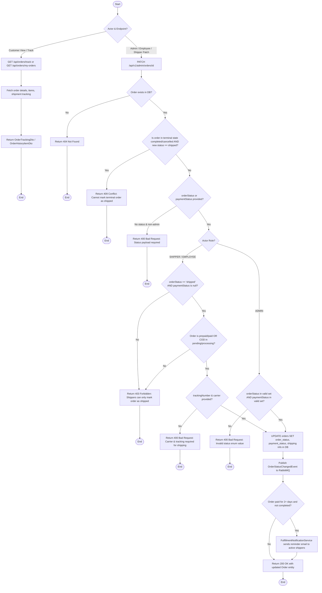

# Order Status Management Activity Diagram

This diagram represents the order status tracking and admin update workflow based on `AdminOrderController`, `OrderStatusController`, `OrderServiceImpl`, and `FulfillmentNotificationService`.

