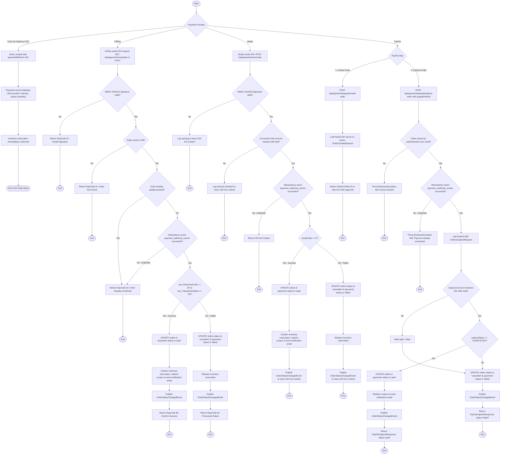

# Payment Processing Activity Diagram

This diagram represents the payment integrations (VNPay, MoMo, PayPal, COD) based on `VnpayPaymentController`, `VnpayPaymentServiceImpl`, `MomoPaymentController`, `MomoPaymentServiceImpl`, `PayPalPaymentController`, and `PayPalPaymentServiceImpl`.

