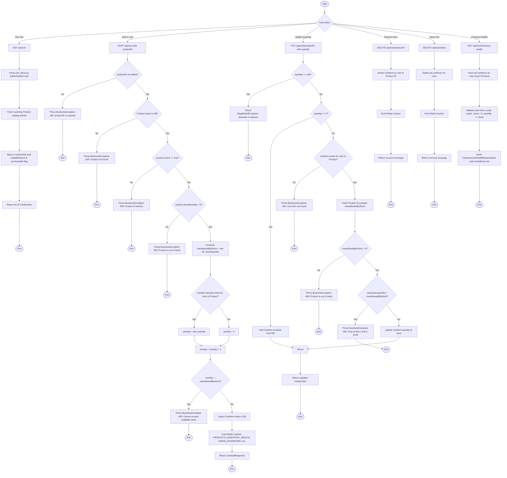

# Shopping Cart Activity Diagram

This diagram represents the shopping cart management workflow based on `CartController`, `CartServiceImpl`, `CartItemRepository`, and `CartAbandonmentReminderService`.

