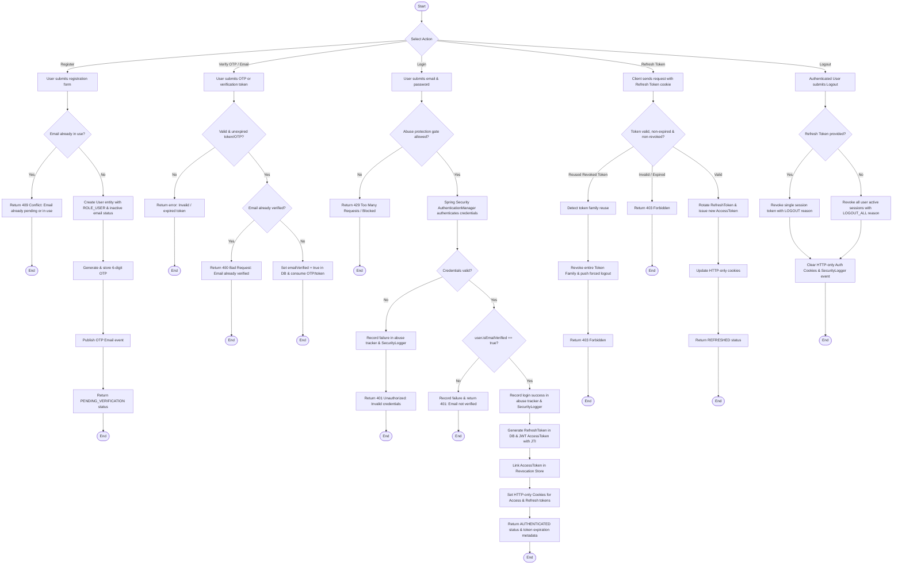

# User Authentication & Management Activity Diagram

This diagram represents the user authentication and identity management workflow based on `AuthController`, `AuthServiceImpl`, `TokenController`, and `UserService`.

