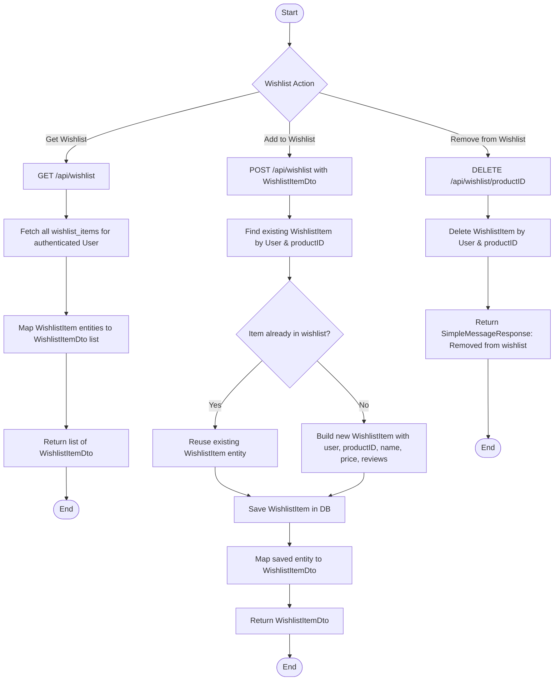

# Wishlist Activity Diagram

This diagram represents the wishlist management workflow based on `WishlistController`, `WishlistServiceImpl`, `WishlistItemRepository`, and `WishlistItem`.

```mermaid
flowchart TD
    Start([Start]) --> ActionChoice{Wishlist Action}

    %% GET WISHLIST
    ActionChoice -->|Get Wishlist| G1[GET /api/wishlist]
    G1 --> GFetch[Fetch all wishlist_items for authenticated User]
    GFetch --> GMap[Map WishlistItem entities to WishlistItemDto list]
    GMap --> GResp[Return list of WishlistItemDto]
    GResp --> EndG([End])

    %% ADD TO WISHLIST
    ActionChoice -->|Add to Wishlist| A1[POST /api/wishlist with WishlistItemDto]
    A1 --> AFind[Find existing WishlistItem by User & productID]
    AFind --> AExists{Item already in wishlist?}
    AExists -->|Yes| AReuse[Reuse existing WishlistItem entity]
    AExists -->|No| ABuild[Build new WishlistItem with user, productID, name, price, reviews]
    AReuse --> ASave[Save WishlistItem in DB]
    ABuild --> ASave
    ASave --> AMap[Map saved entity to WishlistItemDto]
    AMap --> AResp[Return WishlistItemDto]
    AResp --> EndA([End])

    %% REMOVE FROM WISHLIST
    ActionChoice -->|Remove from Wishlist| R1[DELETE /api/wishlist/productID]
    R1 --> RDel[Delete WishlistItem by User & productID]
    RDel --> RResp[Return SimpleMessageResponse: Removed from wishlist]
    RResp --> EndR([End])
```
