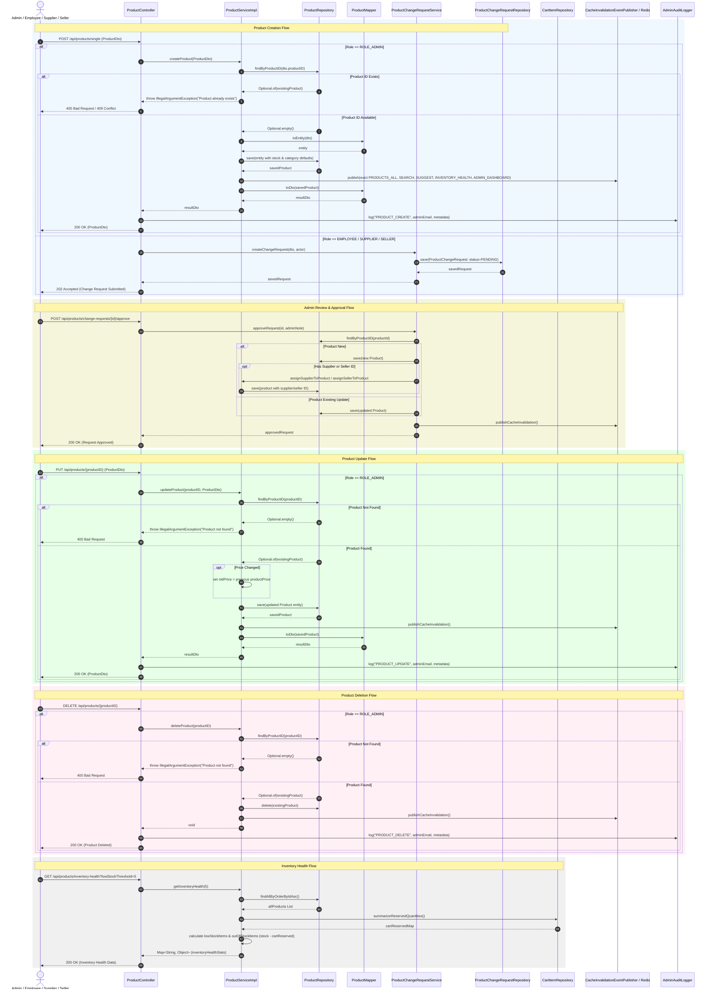

# Admin Product Management Sequence Diagram

This sequence diagram details the runtime interactions for Admin Product CRUD operations, non-admin Change Request submissions, and Inventory Health reporting across `ProductController`, `ProductServiceImpl`, `ProductRepository`, `CartItemRepository`, and `CacheInvalidationEventPublisher`.

