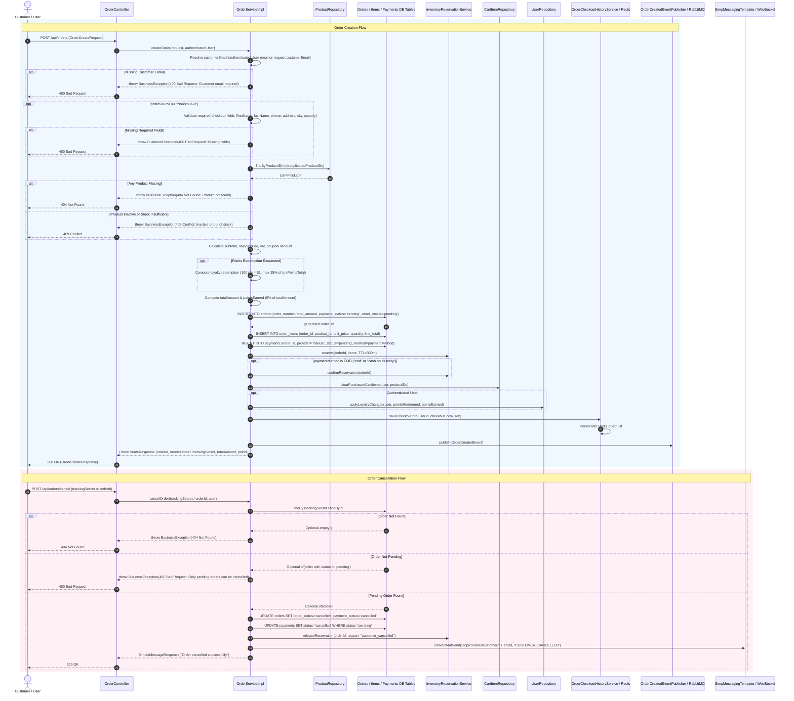

# Order / Checkout Sequence Diagram

This sequence diagram details the runtime interactions for Order Creation and Order Cancellation across `OrderController`, `OrderServiceImpl`, `ProductRepository`, `InventoryReservationService`, `CartItemRepository`, `OrderCheckoutHistoryServiceImpl`, and RabbitMQ / WebSocket event publishers.

