# Payment Processing Sequence Diagram

This sequence diagram details the runtime interactions for VNPay IPN, MoMo IPN, and PayPal Capture implementations across `VnpayPaymentController`, `VnpayPaymentServiceImpl`, `MomoPaymentController`, `MomoPaymentServiceImpl`, `PayPalPaymentController`, `PayPalPaymentServiceImpl`, `PaymentWebhookEventRepository`, and `InventoryReservationService`.

```mermaid
sequenceDiagram
    autonumber
    actor Gateway as Payment Gateway / User
    participant Controller as Payment Controller (VNPay / MoMo / PayPal)
    participant Service as Payment Service Implementation
    participant DB as Orders / Payments DB Tables
    participant Idem as PaymentWebhookEventRepository
    participant IRS as InventoryReservationService
    participant MQ as OrderStatusChangedPublisher / RabbitMQ
    participant ExtAPI as External Provider API (PayPal SDK)

    %% VNPAY IPN CALLBACK
    rect rgb(240, 248, 255)
        note over Gateway, MQ: VNPay IPN Callback Flow
        Gateway->>Controller: GET/POST /api/payments/vnpay/ipn (vnp_Params)
        Controller->>Service: processIpn(vnp_Params)
        Service->>Service: Verify HMAC-SHA512 checksum (vnp_SecureHash)
        alt Invalid Signature
            Service-->>Controller: VnpayIpnResponse(RspCode="97", Message="Invalid Checksum")
            Controller-->>Gateway: 200 OK {"RspCode":"97","Message":"Invalid Checksum"}
        else Valid Signature
            Service->>DB: findOrderByOrderNumber(vnp_TxnRef)
            alt Order Not Found
                DB-->>Service: Optional.empty()
                Service-->>Controller: VnpayIpnResponse(RspCode="01", Message="Order Not Found")
                Controller-->>Gateway: 200 OK {"RspCode":"01","Message":"Order Not Found"}
            else Order Found
                DB-->>Service: order
                alt Order Already Paid/Processed
                    Service-->>Controller: VnpayIpnResponse(RspCode="02", Message="Order Already Confirmed")
                    Controller-->>Gateway: 200 OK {"RspCode":"02","Message":"Order Already Confirmed"}
                else Pending Payment
                    Service->>Idem: save(payment_webhook_events: provider='vnpay', event_key=txnRef)
                    alt Duplicate Webhook Event
                        Idem-->>Service: DataIntegrityViolationException
                        Service-->>Controller: VnpayIpnResponse(RspCode="02", Message="Order Already Confirmed")
                    else New Unique Event
                        Idem-->>Service: savedEvent
                        alt vnp_ResponseCode == "00" AND vnp_TransactionStatus == "00" (SUCCESS)
                            Service->>DB: UPDATE orders SET order_status='paid', payment_status='paid'
                            Service->>DB: UPDATE payments SET provider='vnpay', status='paid', paid_at=NOW()
                            Service->>IRS: confirmReservation(orderId)
                            Service->>MQ: publish(OrderStatusChangedEvent: pending -> paid)
                            Service-->>Controller: VnpayIpnResponse(RspCode="00", Message="Confirm Success")
                            Controller-->>Gateway: 200 OK {"RspCode":"00","Message":"Confirm Success"}
                        else Payment Failed / Cancelled
                            Service->>DB: UPDATE orders SET order_status='cancelled', payment_status='failed'
                            Service->>DB: UPDATE payments SET provider='vnpay', status='failed'
                            Service->>IRS: releaseReservation(orderId, reason="vnpay_failed")
                            Service->>MQ: publish(OrderStatusChangedEvent: pending -> cancelled)
                            Service-->>Controller: VnpayIpnResponse(RspCode="00", Message="Confirm Success")
                            Controller-->>Gateway: 200 OK {"RspCode":"00","Message":"Confirm Success"}
                        end
                    end
                end
            end
        end
    end

    %% MOMO IPN CALLBACK
    rect rgb(245, 245, 220)
        note over Gateway, MQ: MoMo IPN Callback Flow
        Gateway->>Controller: POST /api/payments/momo/ipn (MoMo IPN JSON Body)
        Controller->>Service: processIpn(ipnRequest)
        Service->>Service: Verify HMAC-SHA256 signature
        alt Invalid Signature
            Service-->>Controller: return 204 (log warning)
            Controller-->>Gateway: 204 No Content
        else Valid Signature
            Service->>DB: findOrderByOrderNumber(orderId)
            DB-->>Service: order
            Service->>Service: Validate converted VND amount == order.totalAmount * usdToVndRate
            alt Amount Mismatch
                Service-->>Controller: return 204 (log error)
                Controller-->>Gateway: 204 No Content
            else Amount Valid
                Service->>Idem: save(payment_webhook_events: provider='momo', event_key=transId)
                alt resultCode == 0 (SUCCESS)
                    Service->>DB: UPDATE orders SET order_status='paid', payment_status='paid'
                    Service->>DB: UPDATE payments SET provider='momo', status='paid', paid_at=NOW()
                    Service->>IRS: confirmReservation(orderId)
                    Service->>MQ: publish(OrderStatusChangedEvent)
                    Service-->>Controller: return 204
                    Controller-->>Gateway: 204 No Content
                else resultCode != 0 (FAILED)
                    Service->>DB: UPDATE orders SET order_status='cancelled', payment_status='failed'
                    Service->>DB: UPDATE payments SET provider='momo', status='failed'
                    Service->>IRS: releaseReservation(orderId)
                    Service->>MQ: publish(OrderStatusChangedEvent)
                    Service-->>Controller: return 204
                    Controller-->>Gateway: 204 No Content
                end
            end
        end
    end

    %% PAYPAL CAPTURE FLOW
    rect rgb(230, 255, 230)
        note over Gateway, ExtAPI: PayPal Order Capture Flow
        Gateway->>Controller: POST /api/payments/paypal/capture-order (PayPalCaptureRequest)
        Controller->>Service: capturePayPalOrder(request, authenticatedUser)
        Service->>DB: findOrderByOrderNumber(orderNumber)
        DB-->>Service: order
        Service->>Service: Verify authenticated user email matches order.customerEmail
        alt Ownership Mismatch
            Service-->>Controller: throw BusinessException(403 Access Denied)
            Controller-->>Gateway: 403 Forbidden
        else Ownership Valid
            Service->>Idem: save(payment_webhook_events: provider='paypal', event_key=paypalOrderId)
            alt Duplicate Capture Request
                Idem-->>Service: DataIntegrityViolationException
                Service-->>Controller: throw BusinessException(400 Already Processed)
                Controller-->>Gateway: 400 Bad Request
            else Unique Request
                Service->>ExtAPI: Execute OrdersCaptureRequest(paypalOrderId)
                ExtAPI-->>Service: PayPal API Capture Response
                Service->>Service: Check captureStatus == "COMPLETED" & capturedAmount == order.totalAmount
                alt Capture Successful & Amount Matches
                    Service->>DB: UPDATE orders SET order_status='paid', payment_status='paid'
                    Service->>DB: UPDATE payments SET provider='paypal', status='paid', payment_reference=captureId
                    Service->>MQ: publish(OrderStatusChangedEvent)
                    Service-->>Controller: PayPalCaptureResponse(status="paid", paypalCaptureId)
                    Controller-->>Gateway: 200 OK (PayPalCaptureResponse)
                else Capture Failed or Tampered Amount
                    Service->>DB: UPDATE orders SET order_status='cancelled', payment_status='failed'
                    Service->>DB: UPDATE payments SET provider='paypal', status='failed'
                    Service->>MQ: publish(OrderStatusChangedEvent)
                    Service-->>Controller: PayPalCaptureResponse(status="failed", message="Payment capture failed")
                    Controller-->>Gateway: 200 OK (PayPalCaptureResponse)
                end
            end
        end
    end
```

