# Shopping Cart Sequence Diagram

This sequence diagram details the runtime interactions for View Cart, Add to Cart, Update Quantity, Remove Item, Clear Cart, and Pre-Checkout Health check across `CartController`, `CartServiceImpl`, `CartItemRepository`, `ProductRepository`, and `CacheInvalidationEventPublisher`.

```mermaid
sequenceDiagram
    autonumber
    actor User as Authenticated User
    participant CC as CartController
    participant CS as CartServiceImpl
    participant CR as CartItemRepository
    participant PR as ProductRepository
    participant Cache as CacheInvalidationEventPublisher / Redis

    %% GET CART
    rect rgb(240, 248, 255)
        note over User, PR: Get Cart Flow
        User->>CC: GET /api/cart
        CC->>CS: getCart(user)
        CS->>CR: findByUser(user)
        CR-->>CS: List<CartItem>
        CS->>PR: findByProductIDIn(productIDs)
        PR-->>CS: List<Product>
        CS->>CS: computeMaxAllowedByStock & purchasable flag per item
        CS-->>CC: List<CartItemDto>
        CC-->>User: 200 OK (List<CartItemDto>)
    end

    %% ADD TO CART
    rect rgb(230, 255, 230)
        note over User, Cache: Add to Cart Flow
        User->>CC: POST /api/cart (CartAddRequest: productID)
        CC->>CS: addToCart(user, request)
        CS->>PR: findByProductID(productID)
        alt Product Not Found
            PR-->>CS: Optional.empty()
            CS-->>CC: throw BusinessException(404 Not Found)
            CC-->>User: 404 Not Found (Product not found)
        else Product Inactive
            PR-->>CS: Optional.of(inactiveProduct)
            CS-->>CC: throw BusinessException(409 Conflict: Product inactive)
            CC-->>User: 409 Conflict (Product is inactive)
        else Stock <= 0
            PR-->>CS: Optional.of(outOfStockProduct)
            CS-->>CC: throw BusinessException(409 Conflict: Out of stock)
            CC-->>User: 409 Conflict (Product is out of stock)
        else Product Active & Stock Available
            PR-->>CS: Optional.of(product)
            CS->>CR: findByUserAndProductID(user, productID)
            alt Existing CartItem
                CR-->>CS: Optional.of(existingCartItem)
            else New CartItem
                CR-->>CS: Optional.empty()
            end
            CS->>CS: newQty = ownQty + 1
            alt newQty > maxAllowedByStock (min 20, stockQuantity)
                CS-->>CC: throw BusinessException(409 Conflict: Cannot exceed stock)
                CC-->>User: 409 Conflict (Cannot exceed available stock)
            else newQty <= maxAllowedByStock
                CS->>CR: save(CartItem entity)
                CR-->>CS: savedCartItem
                CS->>Cache: publishCartCacheInvalidation()
                CS-->>CC: CartItemDto
                CC-->>User: 200 OK (CartAddResponse: productID, quantity)
            end
        end
    end

    %% UPDATE QUANTITY
    rect rgb(255, 240, 245)
        note over User, Cache: Update Cart Quantity Flow
        User->>CC: PUT /api/cart/{productID} (CartUpdateQuantityRequest: quantity)
        alt Quantity is Null
            CC-->>User: throw IllegalStateException("Quantity is required")
        else Quantity <= 0
            CC->>CS: updateQuantity(user, productID, quantity)
            CS->>CR: findByUserAndProductID(user, productID)
            CR-->>CS: CartItem
            CS->>CR: delete(CartItem)
            CS->>Cache: publishCartCacheInvalidation()
            CS-->>CC: CartItemDto (quantity=0)
            CC-->>User: 200 OK (Item removed)
        else Quantity > 0
            CC->>CS: updateQuantity(user, productID, quantity)
            CS->>CR: findByUserAndProductID(user, productID)
            CR-->>CS: CartItem
            CS->>PR: findByProductID(productID)
            PR-->>CS: Product
            alt quantity > maxAllowedByStock
                CS-->>CC: throw BusinessException(409 Conflict: Insufficient stock)
                CC-->>User: 409 Conflict (Only N item(s) left in stock)
            else quantity <= maxAllowedByStock
                CS->>CR: save(updated CartItem)
                CR-->>CS: savedCartItem
                CS->>Cache: publishCartCacheInvalidation()
                CS-->>CC: CartItemDto
                CC-->>User: 200 OK (CartItemDto)
            end
        end
    end

    %% REMOVE FROM CART
    rect rgb(245, 245, 220)
        note over User, Cache: Remove Item / Clear Cart Flow
        User->>CC: DELETE /api/cart/{productID}
        CC->>CS: removeFromCart(user, productID)
        CS->>CR: deleteByUserAndProductID(user, productID)
        CS->>Cache: publishCartCacheInvalidation()
        CS-->>CC: void
        CC-->>User: 200 OK (Message: Removed from cart)
    end

    %% CHECKOUT HEALTH CHECK
    rect rgb(240, 240, 240)
        note over User, PR: Checkout Health Flow
        User->>CC: GET /api/cart/checkout-health
        CC->>CS: getCheckoutHealth(user)
        CS->>CR: findByUser(user)
        CR-->>CS: List<CartItem>
        CS->>PR: findByProductIDIn(productIDs)
        PR-->>CS: List<Product>
        CS->>CS: Audit items (check NOT_FOUND, INACTIVE, OUT_OF_STOCK, INSUFFICIENT_STOCK)
        CS-->>CC: CartCheckoutHealthResponseDto (canCheckout, invalidItems)
        CC-->>User: 200 OK (CartCheckoutHealthResponseDto)
    end
```

