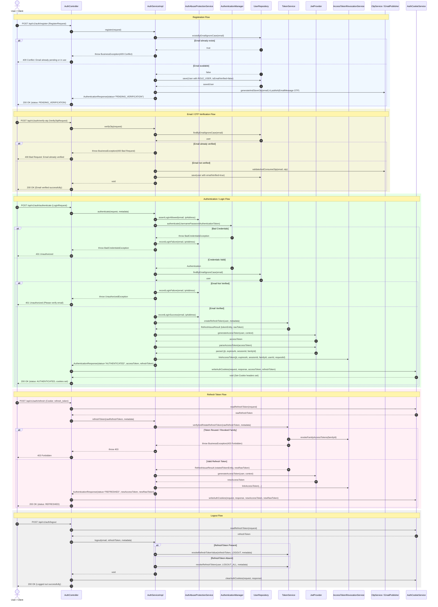

# User Authentication Sequence Diagram

This sequence diagram details the runtime interactions for User Registration, Login, Token Refresh, Email/OTP Verification, and Logout across `AuthController`, `AuthServiceImpl`, `TokenService`, `JwtProvider`, and Spring Security.

