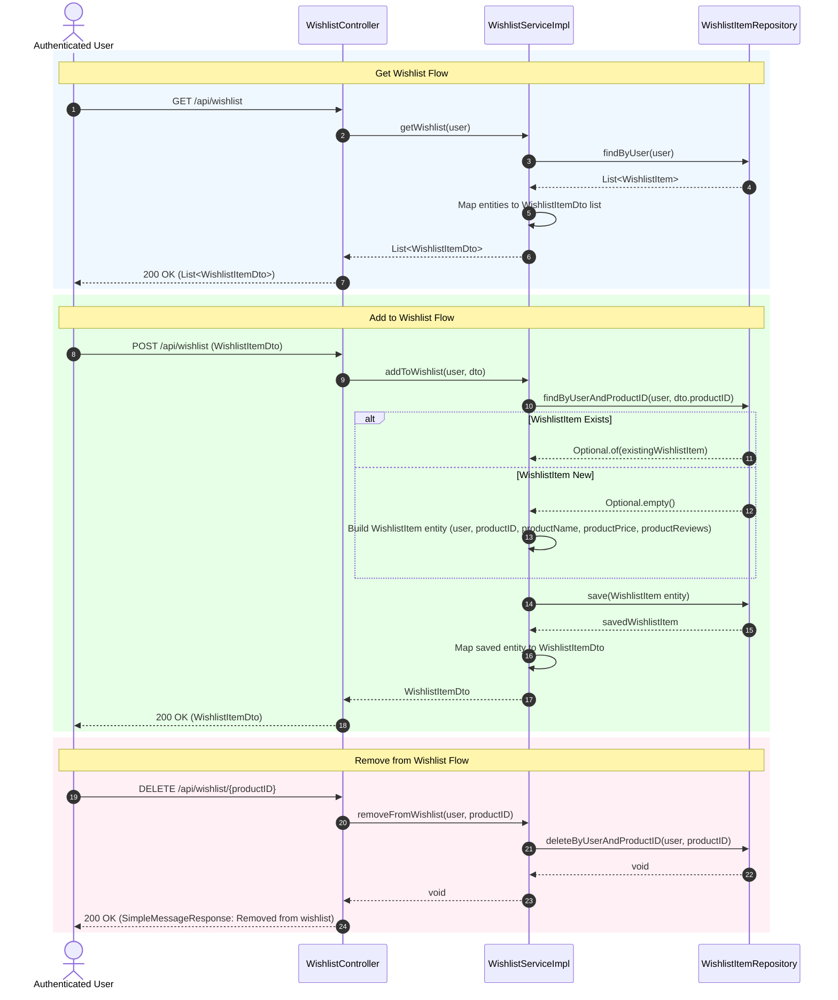

# Wishlist Sequence Diagram

This sequence diagram details the runtime interactions for View Wishlist, Add to Wishlist (Snapshot Upsert), and Remove from Wishlist across `WishlistController`, `WishlistServiceImpl`, and `WishlistItemRepository`.

