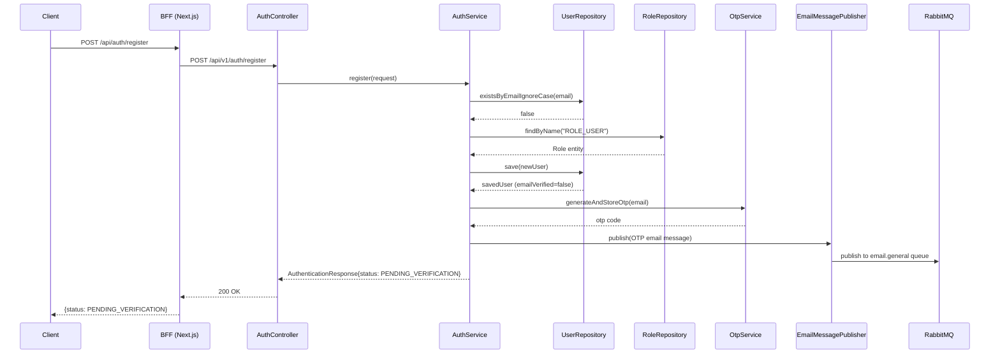
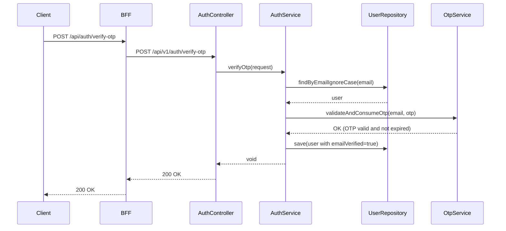
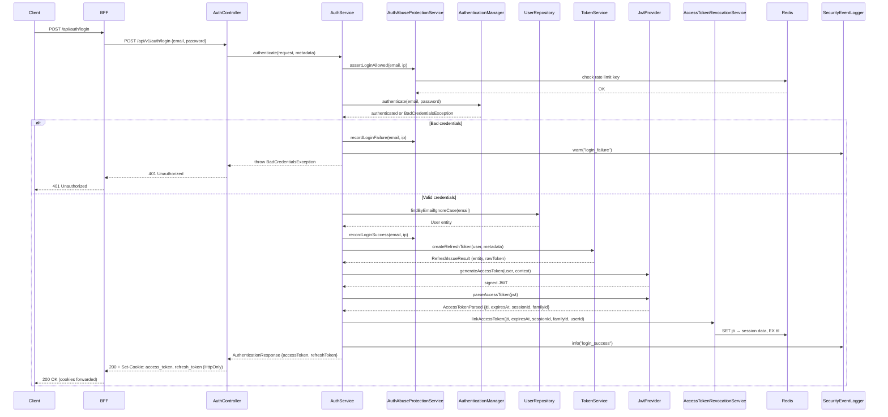
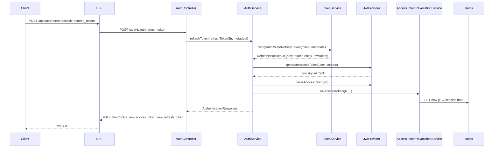
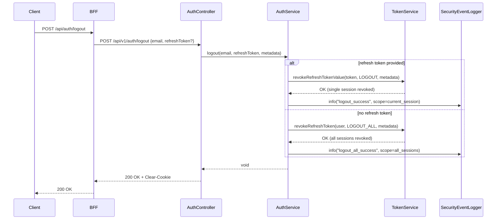
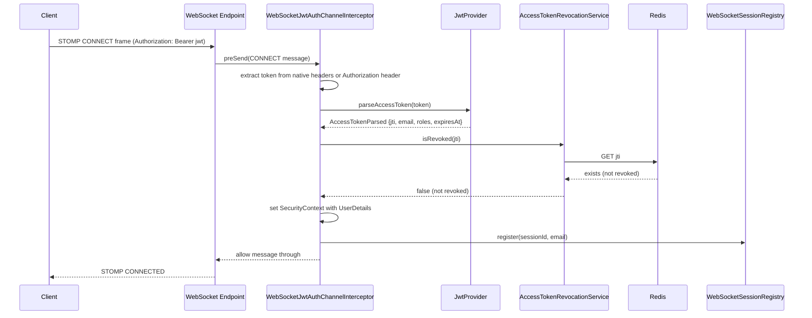

# Authentication Sequence Diagram

Traced from [`AuthServiceImpl.java`](../../backend/src/main/java/com/example/shop/modules/auth/service/AuthServiceImpl.java), [`WebSocketJwtAuthChannelInterceptor.java`](../../backend/src/main/java/com/example/shop/config/WebSocketJwtAuthChannelInterceptor.java).

## Registration

## OTP Verification

## Login

## Token Refresh

## Logout

## WebSocket STOMP Authentication

