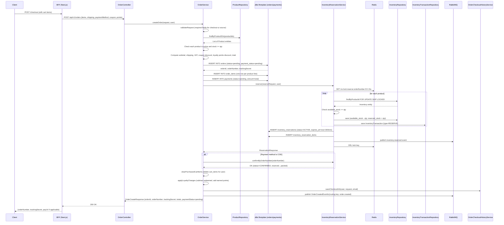
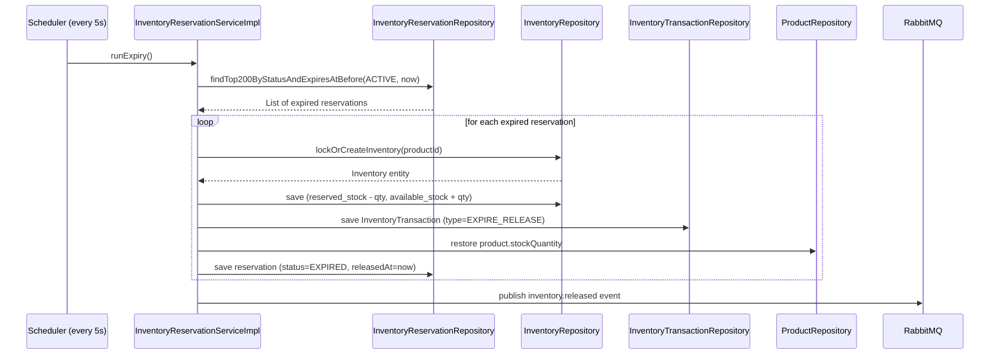

# Checkout Sequence Diagram

Traced from [`OrderServiceImpl.java`](../../backend/src/main/java/com/example/shop/modules/order/service/OrderServiceImpl.java) and [`InventoryReservationServiceImpl.java`](../../backend/src/main/java/com/example/shop/modules/inventory/service/InventoryReservationServiceImpl.java).

## Checkout — Order Creation

## Inventory Expiry (Background Scheduler)

