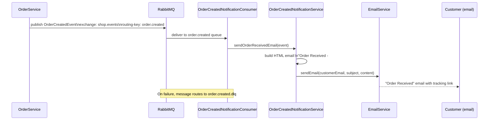
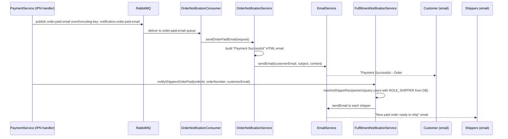
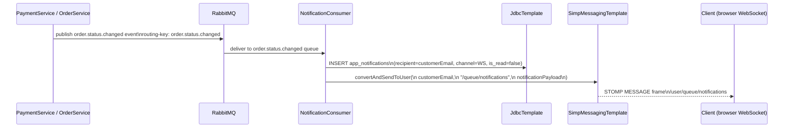
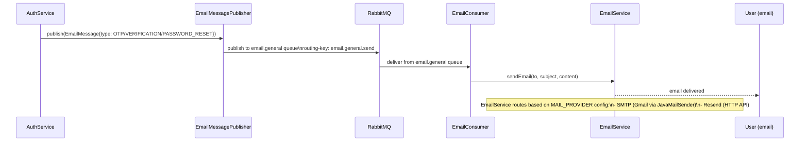
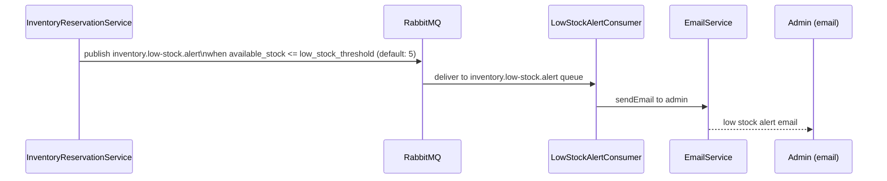
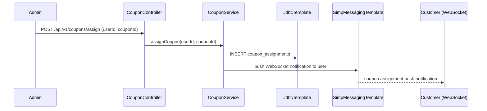
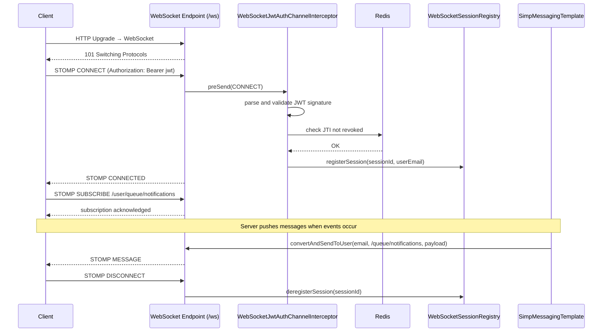

# Notifications Sequence Diagram

Traced from [`OrderCreatedNotificationService.java`](../../backend/src/main/java/com/example/shop/modules/notification/service/OrderCreatedNotificationService.java), [`OrderNotificationService.java`](../../backend/src/main/java/com/example/shop/modules/notification/service/OrderNotificationService.java), [`FulfillmentNotificationService.java`](../../backend/src/main/java/com/example/shop/modules/order/service/FulfillmentNotificationService.java), and [`application.yml`](../../backend/src/main/resources/application.yml).

## RabbitMQ Exchange and Queue Map

| Queue | Routing Key | Consumer |
|---|---|---|
| `order.created` | `order.created` | OrderCreatedNotificationConsumer → email to customer |
| `order.created.analytics` | `order.created` | Analytics consumer |
| `order.created.fraud.check` | `order.created` | Fraud assessment consumer |
| `order.paid.email` | `notification.order.paid.email` | OrderNotificationConsumer → payment confirmed email |
| `order.status.changed` | `order.status.changed` | WebSocket push + app_notifications |
| `email.general` | `email.general.send` | General email consumer (OTP, password reset, verification) |
| `inventory.low-stock.alert` | `inventory.low-stock.alert` | Low stock email to admin |
| `cart.abandoned` | `cart.abandoned` | Cart abandonment reminder email |
| `payment.ipn.process` | `payment.vnpay.ipn` | IPN processing consumer |
| `audit.event` | `audit.event` | Audit log consumer |

All queues have corresponding Dead Letter Queues (DLQ) suffixed with `.dlq`.

Exchange: `shop.events` (topic exchange).

---

## Order Created Notification (Email to Customer)

## Payment Confirmed Notification (Email + Shipper Alert)

## Order Status Changed Notification (WebSocket Push)

## General Email Notifications (OTP, Verification, Password Reset)

## Low-Stock Alert Notification

## Coupon Assignment Notification

## WebSocket Session Lifecycle

