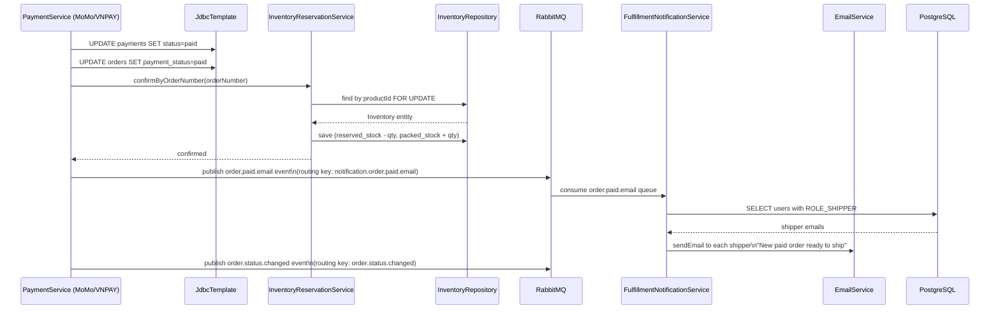
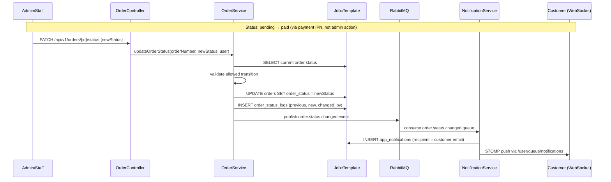
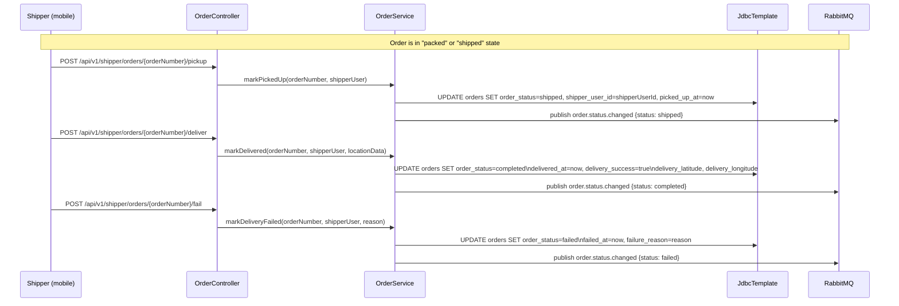
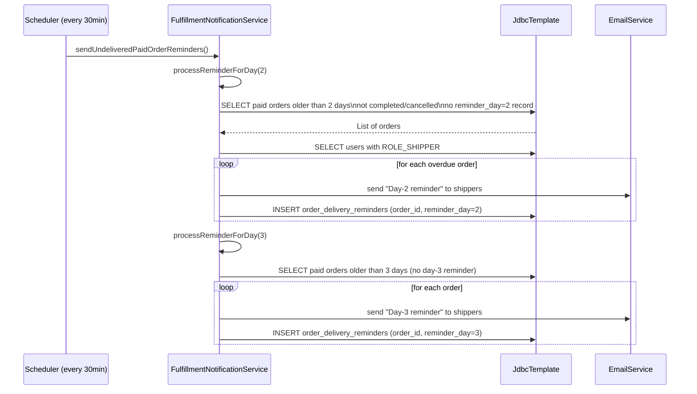
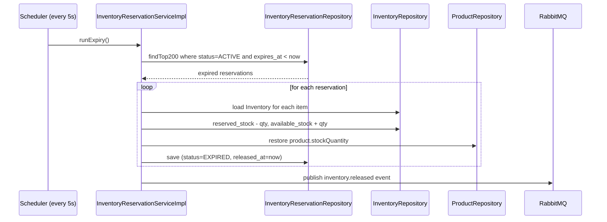

# Order Processing Sequence Diagram

Traced from [`OrderServiceImpl.java`](../../backend/src/main/java/com/example/shop/modules/order/service/OrderServiceImpl.java), [`FulfillmentNotificationService.java`](../../backend/src/main/java/com/example/shop/modules/order/service/FulfillmentNotificationService.java), and RabbitMQ config in [`application.yml`](../../backend/src/main/resources/application.yml).

## Payment Confirmed → Fulfillment Notification

## Order Status Transitions (Admin/Staff Actions)

## Shipper Delivery Flow

## Undelivered Order Reminders (Scheduled)

## Inventory Reservation Expiry (Background)

