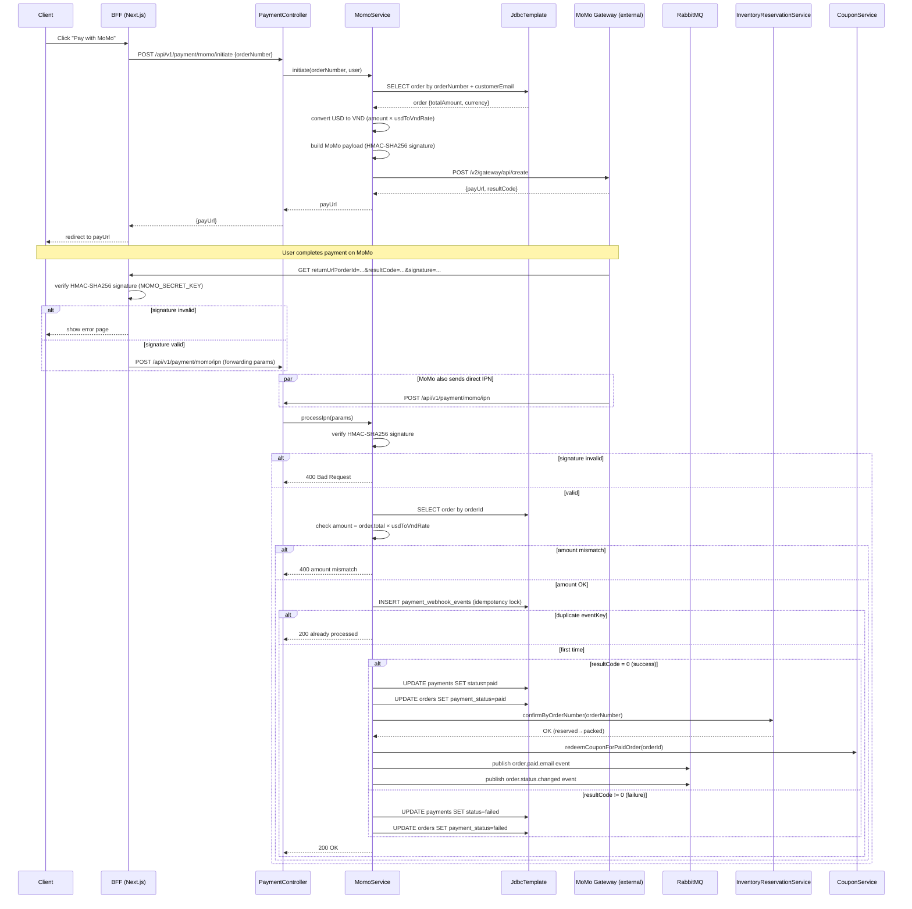
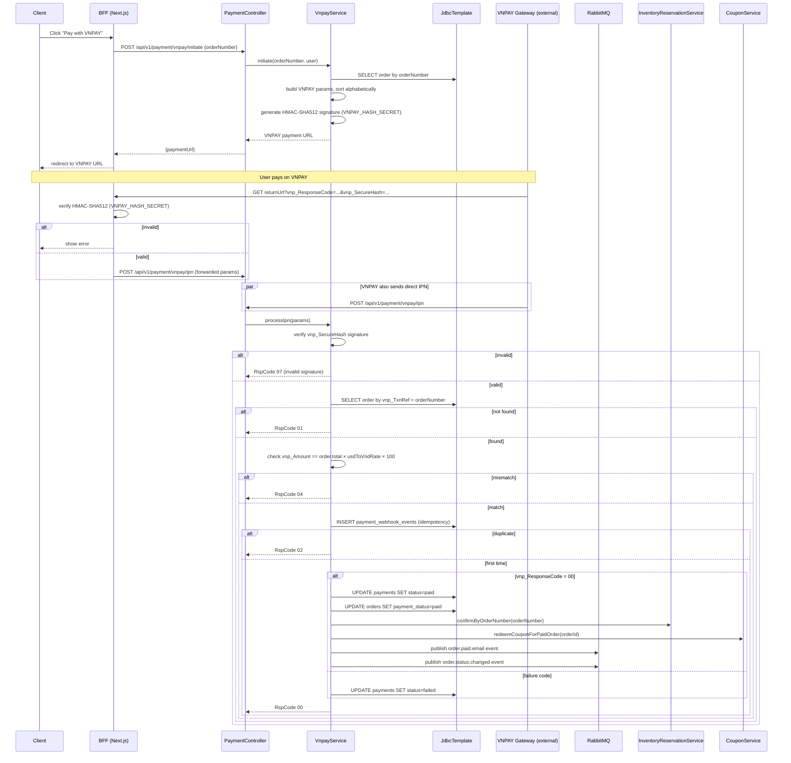
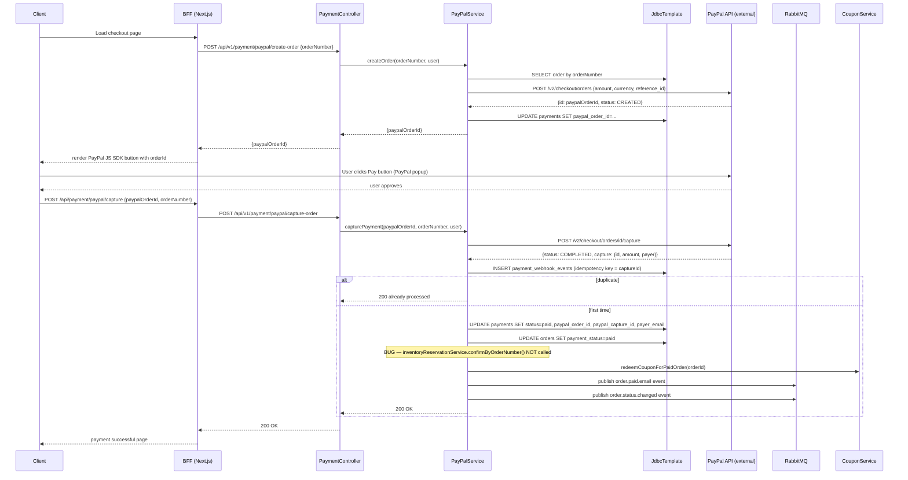

# Payment Sequence Diagrams

Traced from [`MomoPaymentServiceImpl.java`](../../backend/src/main/java/com/example/shop/modules/payment/service/MomoPaymentServiceImpl.java), [`VnpayPaymentServiceImpl.java`](../../backend/src/main/java/com/example/shop/modules/payment/service/VnpayPaymentServiceImpl.java), and [`PayPalPaymentServiceImpl.java`](../../backend/src/main/java/com/example/shop/modules/payment/paypal/service/PayPalPaymentServiceImpl.java).

> [!CAUTION]
> **PayPal Inventory Bug**: `PayPalPaymentServiceImpl.triggerPostPaymentActions()` does **not** call `inventoryReservationService.confirmByOrderNumber()`. The reservation expires via the 5-second scheduler and stock is restored incorrectly.

---

## MoMo Payment Sequence

---

## VNPAY Payment Sequence

---

## PayPal Payment Sequence

> [!WARNING]
> After capture, `inventoryReservationService.confirmByOrderNumber()` is **not called**. The inventory reservation will expire and stock will be incorrectly restored.

